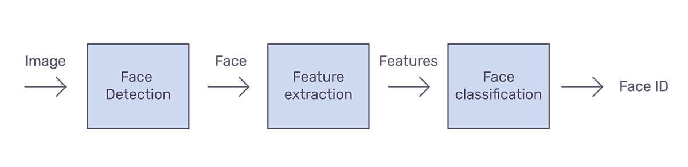

# Disclaimer
I do not claim any of my public repository work to be completely mine though I try to give full credit to repository I am picking from.
It is generally a mix of  implementation from multiple repository, learning and building on and above them to my use-cases.
In this project I have build up a production grade surveillance system, the mix of tech-stack used in this project is what I think is the best way of buidling a production grade face-recognition based system.
This has been a part of system tested on site in gyms for authentication but there are many improvement in the way things are done could be improved.

# FootFallTrackerboT_POC
Demo 

ScreenShot of applications in work. 

## features 
1. Load anyWhere
2. No extra cloud cost
3. 

## About

## **Application Architecture**
content goes here
tensorflow.js used for inferencing -- Angular UI -- Firebase backend -- tensorflow.js
Load it in your mobile

## **MTCNN+FaceNet model used** 
We will use a combination of two model i.e. MTCNN + Face-net 

### **MTCNN For Face-Detection** [[2016 by Zhang et al.](https://arxiv.org/abs/1604.02878)]
MTCNN Model stand alone is capable of finding face in a picture, providing rectangular Object detection box as an output.

  
  

As shown in image below MTCNN's cascaded architecture takes to ensure the best performance in human face detection and bounding box regression.
It mainly has three Stages:
1. **Stage 1:** The Proposal Network (**P-Net**): This Proposal Network is used to obtain candidate windows and their bounding box regression vectors. 
2. **Stage 2:** The Refine Network (**R-Net**): The R-Net outputs wether the input is a face or not, a 4 element vector which is the bounding box for the face, and a 10 element vector for facial landmark localization.
3. **Stage 3:** The Output Network (**O-Net**): This stage is similar to the R-Net, but this Output Network aims to describe the face in more detail and output the five facial landmarks’ positions for eyes, nose and mouth, as shown in celebrity image above. 

  
  

We can extract the sub-image from these bounding boxes to be feed into second neural-network, like this:

  
  

MTCNN: Stage architecture of the model used for face detection and landmark extraction.

Three output of MTCNN:
1. **Face classification:** Whether the given image has face or not, this is a binary classification problem that uses cross-entropy loss.
2. **Bounding box regression:**  What are the points of bounding box, this is a binary classification problem that uses cross-entropy loss
3. **Facial Landmark localization:** location of left eye, right eye, nose, left mouth corner and right mouth corner,  the localization of facial landmarks is formulated as a regression problem, in which the loss function is Euclidean distance.

### Face-Net for Face-recognition [[2015 Schroff et al., Google](https://arxiv.org/abs/1503.03832)]
Now Given this face boundary-box our aim is to recognize whose face is this? For this we use our plain old embedding way of doing things.
We convert this face into a vector in 128-d space. This vector representation gives us freedom to compare two different faces in terms of similiairty. Infact it goes us much more then that.
Given this feature vector now You can do all vector operation possible like clustering, KNN modeling, Euclidean distance  etc with a meaningful output.
Let's jump into it, we will use Face-net model which user Triplet-loss function to get output.

Now club all these model together to have a pipeline. We have performed face detection using MTCNN, feature extraction using FaceNet and classification using Softmax.

Similar We can also have model for face-expression recognition, age-recognition which can be clubbed with the embeddings or train as a ground-up model to be used for crucial user analytics.

## model Quantization and optimization using the tensorflow.js to work in browser
content goes here

## Re-train and re-deploying model in production for better local accuracy
content goes here

## face embedding average vs clusters 
content goes here

## user-workflow
