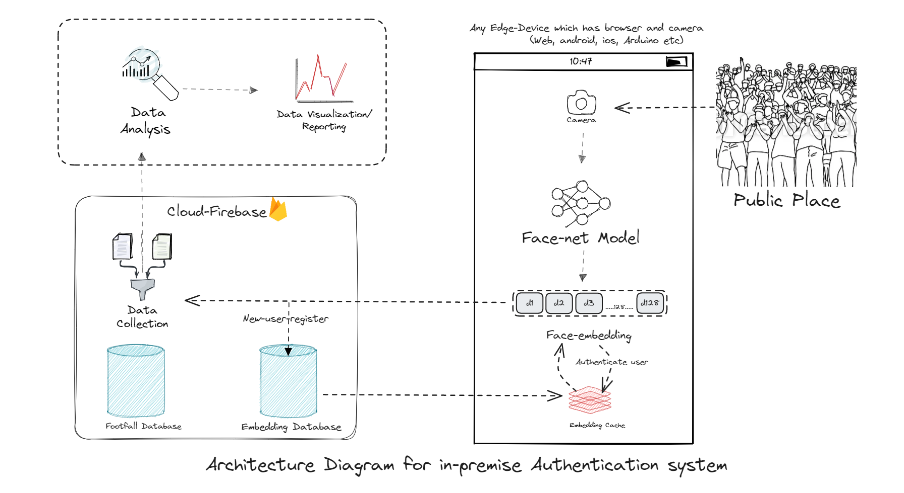

---
## **Introduction** | [Live Demo](https://im-himanshu.github.io/LiveFaceDetection-TensorFlowJs/)
Please Note: Live Demo here is just the demonstration of ability to run ML model in browser, and it takes nearly 3-min to load the model for the first time.
[Authentication Demo](https://footfalltracker-cc13e.firebaseapp.com/main/registerTrack) (sign in using: himanshugoyal414@yahoo.com, testing1234> sign-in> toggle radio button> start-tracking> )

This project is about building a **video based authentication system** that does all the ML computation on user machine and require little to no computation on server side. Moreover, the application should be able to run in any user machine avaialible i.e. (ios, android, windows etc). How do we solve this problem? we utilize a mix of technology that enables this architecture.
1. We convert and optimize our two  model **MTCNN + Facenet using Tensorflow.js** to be able to load in any web browser.
2. We build a progressive web app **(PWA) in Angular + Ionic + Cordova** that can be build in apk, web, ios bundle directly for building native app 
3. We build an embedding **database in Firebase** that saved registered user and authenticate register person.
4. A proprietary algorithm that tracks user in-house time to track resource usage.  
<table>
<tr>  
<td>
   
   <figcaption>User-Authentication model-1</figcaption>
</td>  
<td>
   
   <figcaption>Model-2: User-emotion-surprised</figcaption>
</td>  
<td>
   
   <figcaption>Model-2: User-emotion-happy</figcaption>
</td>  
</tr>
</table>

----
## **Application Architecture**

Architecture diagram of the whole application with three main parts:
1. User side application, basically a PWA which is able to run tensorflow.js optimized model in any device.
   1. Camera input is streamed to the model which then detects the person in it and output the face-embedding vectors.
   2. This embedding is checked for similarity from authorized user and user is authenticated or non-authorized.
   3. User-activity info is send to the database.
2. Cloud database provide info of authorized user and save activity.
3. Data analysis is done on the user-activity data to present meaningful report to user.

## **features** 
1. Multi-platform support i.e. Web, native-Android,ios etc
2. ML Computation on user hardware with tensorflow.js 
3. Real-time dashboard and Low-internet bandwidth requirement for video based authentication

---
# Technical Details and in-depth Understanding
## **MTCNN+FaceNet model used** 
We will use a combination of two model i.e. MTCNN + Face-net 

### **MTCNN For Face-Detection** [[2016 by Zhang et al.](https://arxiv.org/abs/1604.02878)]
MTCNN Model stand alone is capable of finding face in a picture, providing rectangular Object detection box as an output.

  
  

As shown in image below MTCNN's cascaded architecture takes to ensure the best performance in human face detection and bounding box regression.
It mainly has three Stages:
1. **Stage 1:** The Proposal Network (**P-Net**): This Proposal Network is used to obtain candidate windows and their bounding box regression vectors. 
2. **Stage 2:** The Refine Network (**R-Net**): The R-Net outputs wether the input is a face or not, a 4 element vector which is the bounding box for the face, and a 10 element vector for facial landmark localization.
3. **Stage 3:** The Output Network (**O-Net**): This stage is similar to the R-Net, but this Output Network aims to describe the face in more detail and output the five facial landmarks’ positions for eyes, nose and mouth, as shown in celebrity image above. 

  
  

We can extract the sub-image from these bounding boxes to be feed into second neural-network, like this:

  
  

MTCNN: Stage architecture of the model used for face detection and landmark extraction.

Three output of MTCNN:
1. **Face classification:** Whether the given image has face or not, this is a binary classification problem that uses cross-entropy loss.
2. **Bounding box regression:**  What are the points of bounding box, this is a binary classification problem that uses cross-entropy loss
3. **Facial Landmark localization:** location of left eye, right eye, nose, left mouth corner and right mouth corner,  the localization of facial landmarks is formulated as a regression problem, in which the loss function is Euclidean distance.

### **Face-Net for Face-recognition** [[2015 Schroff et al., Google](https://arxiv.org/abs/1503.03832)]
Now Given this face boundary-box our aim is to recognize whose face is this? For this we use our plain old embedding way of doing things.
We convert this face into a vector in 128-d space. This vector representation gives us freedom to compare two different faces in terms of similiairty. Infact it goes us much more then that.
Given this feature vector now You can do all vector operation possible like clustering, KNN modeling, Euclidean distance  etc with a meaningful output.
Let's jump into it, we will use Face-net model which user Triplet-loss function to get output.

Now club all these model together to have a pipeline. We have performed face detection using MTCNN, feature extraction using FaceNet and classification using Softmax.

Similar We can also have model for face-expression recognition, age-recognition which can be clubbed with the embeddings or train as a ground-up model to be used for crucial user analytics.

## Model Quantization and optimization using the tensorflow.js to work in browser
We have used pre-trained network and converted them to run directly in browser via tensorflow.js library. [Tutorial](https://www.tensorflow.org/js/tutorials)

[//]: # (content goes here)

[//]: # ()
[//]: # ()
[//]: # (## Re-train and re-deploying model in production for better local accuracy)

[//]: # (content goes here)

[//]: # ()
[//]: # (## face embedding average vs clusters )

[//]: # (content goes here)

[//]: # ()
[//]: # ()
[//]: # ()
[//]: # (## user-workflow)

### Disclaimer
I do not claim most of my public repository work to be completely mine though I try to give full credit to repository I am building upon.

